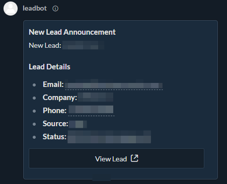

# Zoho Cliq New Lead Notification Bot

This repository contains the Deluge script used to automate sending new lead notifications from Zoho CRM to a designated channel in Zoho Cliq.

## Features:
- Detects new lead creation in Zoho CRM.
- Fetches lead details (Name, Email, Company, Phone, Source, Status).
- Constructs a formatted "Modern Inline" message card in Zoho Cliq.
- Includes a "View Lead" button that links directly to the CRM lead record.

## Deluge Script
- `SendLeadToCliq`: Contains the main Deluge function.

## Setup in Zoho CRM
1. Navigate to **Setup > Automation > Workflow Rules**.
2. Create a new workflow rule on the **Leads** module.
3. Set the trigger to **On a record action > Create**.
4. (Optional) Add conditions to filter which leads trigger the notification.
5. Add an **Instant Action > Function**.
6. Create a new function (or select existing) and paste the code from `SendLeadToCliq`.
7. Configure arguments: Map `LeadID` to `Leads Module > Lead Id`.
8. Ensure your Zoho Cliq Connection (`[ZOHO_OAUTH_CONNECTION]`) is set up in **Setup > Developer Space > Connections**.

## Configuration in Script:
- `record_link`: Update the `org[YOUR_ORG_ID]` placeholder with your actual Zoho CRM Organization ID when deploying to CRM.
- `zoho.cliq.postToChannelAsBot("[CHANNEL_NAME]", "[BOT_NAME]", ...)`: Update `"[CHANNEL_NAME]"` to your target channel name and `"[BOT_NAME]"` to your bot name if different.

## Censored Information:
- Zoho CRM Organization ID is replaced with `org[YOUR_ORG_ID]` placeholder for public sharing.

## Message Card Preview:

